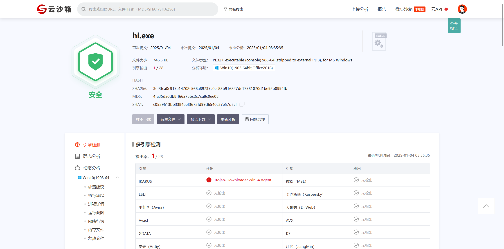
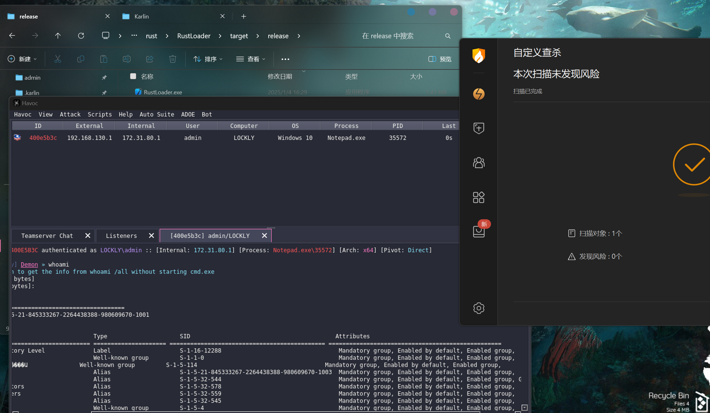
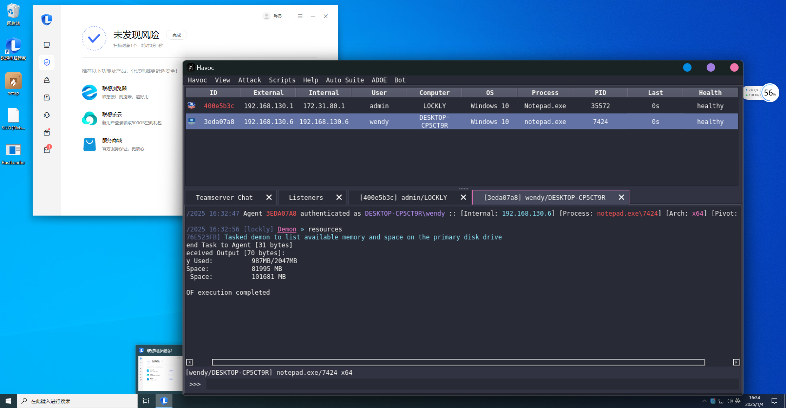
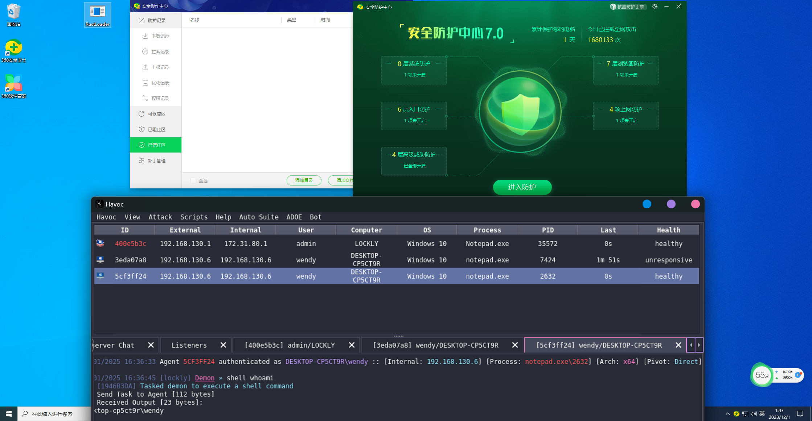
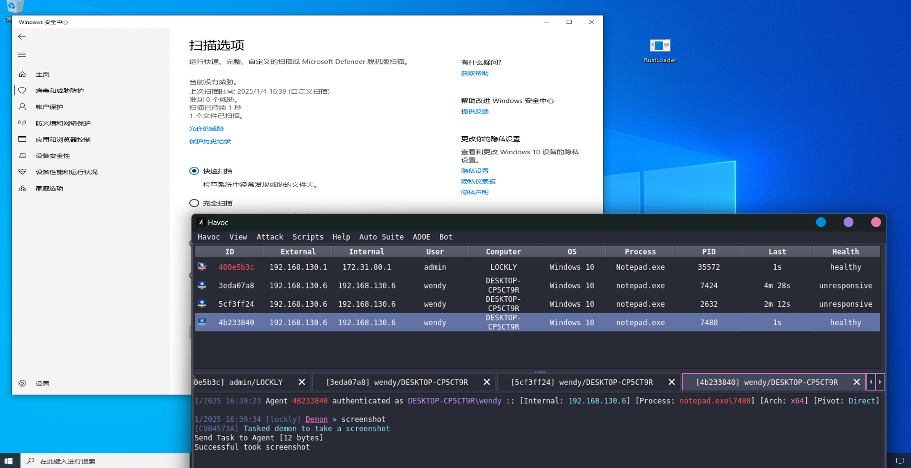

# RustLoader

> 学习rust的练习项目,shellcode未经加密解密处理❗

## 使用
运行`gen.py`填入url, 以及注入的进程(默认为notepad)
``` python
python gen.py
```

将控制台上输出的变量去替代对应位置的变量, 之后开始编译:
``` pwsh
cargo build --release
```
生成物位于`target/release/`，可以用`strip`再次剥离其中的调试信息和其他不必要的数据。

``` pwsh
cargo install cargo-strip
cargo strip -t target/release/RustLoader.exe
```
upx压缩(之后最好patcher处理一下)
``` pwsh
upx -9 --best --force target/release/RustLoader.exe
```

## 测试
添加反沙箱后, 无法在虚拟机中测试, 以下测试均使用直接生成的产物(不使用upx, upx-patcher, 反沙箱)

微步测试检出`1/28`

火绒

腾讯电脑管家

360

defender
