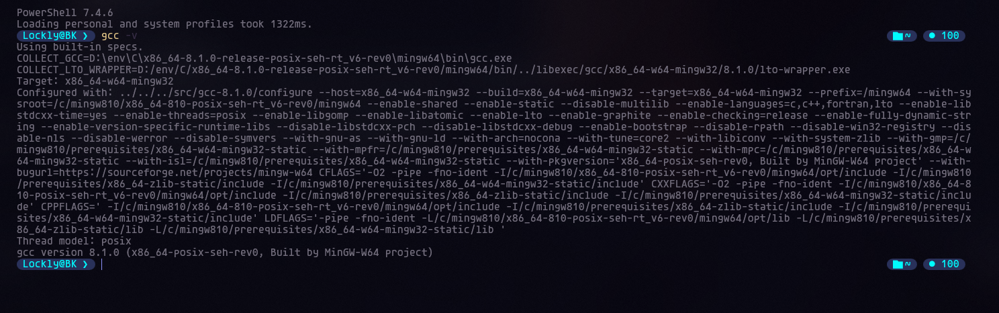
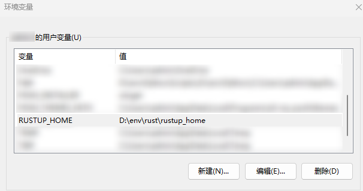
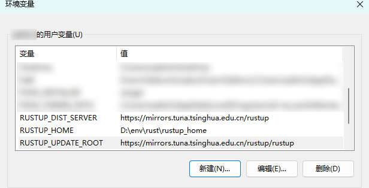
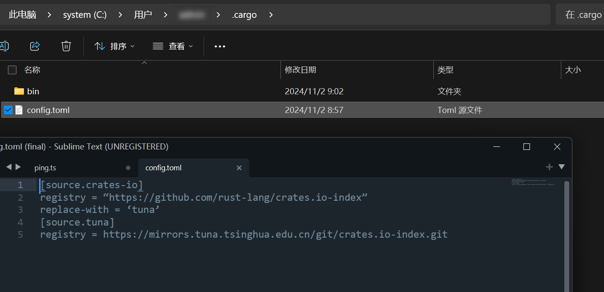
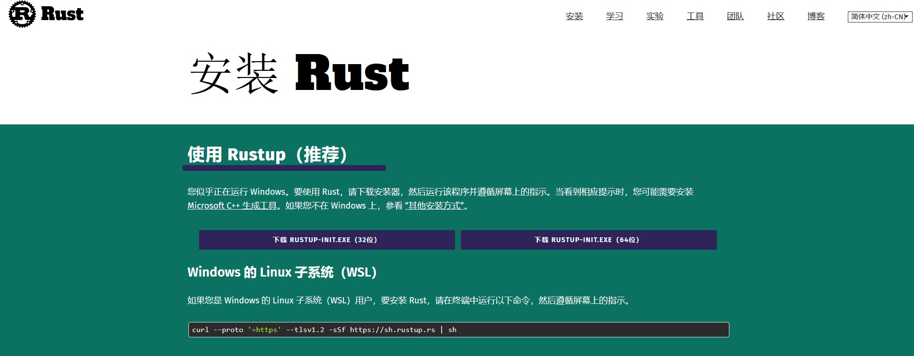
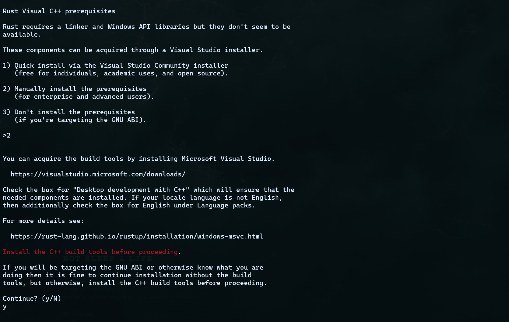
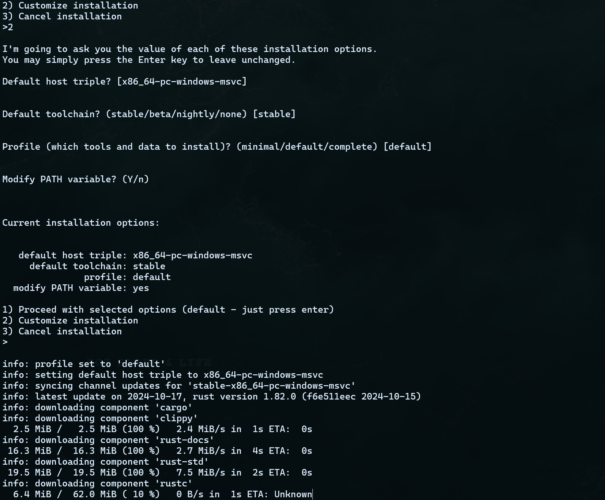
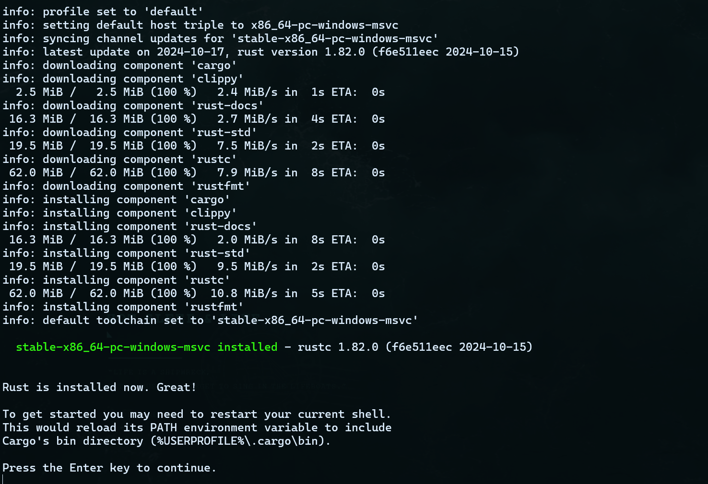
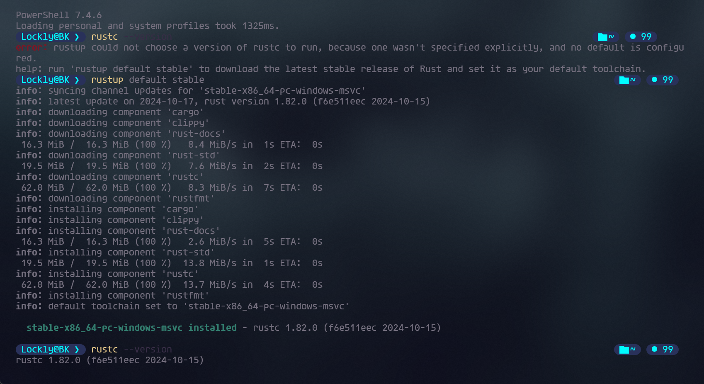

# 安装mingw64(C语言环境)

Rust默认使用的C语言依赖Visual Studio，但该工具占用空间大安装也较为麻烦，可以选用轻便的mingw64包。  
1.1 安装地址

(1) 下载地址1-GitHub：[Releases · niXman/mingw-builds-binaries · GitHub](https://github.com/niXman/mingw-builds-binaries/releases)  
(2) 下载地址2-WinLibs：[WinLibs - GCC+MinGW-w64 compiler for Windows](https://winlibs.com/)

​​

‍

‍

## 安装rust

不想安装到c盘故设置环境变量

RUSTUP\_HOME D:\\env\\rust\\rustup\_home  
 CARGO\_HOME D:\\env\rust\\cargo\_home

​​

(1) 直接从官方网站下载会很慢，改用国内镜像加速安装，设置以下环境变量：

RUSTUP_DIST_SERVER https://mirrors.tuna.tsinghua.edu.cn/rustup  
RUSTUP_UPDATE_ROOT https://mirrors.tuna.tsinghua.edu.cn/rustup/rustup

​​

配置库镜像（类似python的pip）：在`C:\\Users\\用户名\\`​下创建`.cargo`​文件夹，在文件夹内创建`config.tom`​文件，如下图：

​​

[官网](https://www.rust-lang.org/zh-CN/tools/install)下载

​​

选项要求必须安装C/C++的编译环境，默认是 visual studio安装器，而此次使用mingw64，因此需要手动修改为 **2**，然后输入 **y**，如下图：

​​

继续输入2:

​​

接下来一直回车开始下载:

​​

看到这里的提示已完成,退出窗口

​​

验证一下安装情况

```bash
rustc --version
```

​​
